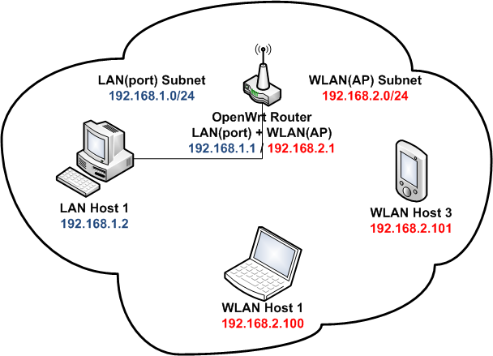

#OpenWrt와 Raspberry PI2를 이용한 공유기 만들기


##0. 서론
Raspberry Pi2와 <span class="TERM">OpenWrt</span>를 이용하여 시중에서 구할 수 있는 공유기를 만드는 예제입니다.
본 예제에서 구현하고자하는 공유기의 포톨로지와 공유기의 인터페이스 정보는 다음과 같습니다.


<figcaption>Fig1. Topology</figcaption>

```
root@openwrt:~$ ifconfig
eth0      Link encap:Ethernet  HWaddr 00:90:f5:e4:cb:2c  
          inet addr:192.168.1.1  Bcast:192.168.1.255  Mask:255.255.255.0
          inet6 addr: fe80::290:f5ff:fee4:cb2c/64 Scope:Link
          UP BROADCAST RUNNING MULTICAST  MTU:1500  Metric:1
          RX packets:823383 errors:0 dropped:5 overruns:0 frame:0
          TX packets:99326 errors:0 dropped:0 overruns:0 carrier:0
          collisions:0 txqueuelen:1000 
          RX bytes:271224907 (271.2 MB)  TX bytes:9310318 (9.3 MB)

lo        Link encap:Local Loopback  
          inet addr:127.0.0.1  Mask:255.0.0.0
          inet6 addr: ::1/128 Scope:Host
          UP LOOPBACK RUNNING  MTU:65536  Metric:1
          RX packets:6436 errors:0 dropped:0 overruns:0 frame:0
          TX packets:6436 errors:0 dropped:0 overruns:0 carrier:0
          collisions:0 txqueuelen:0 
          RX bytes:760775 (760.7 KB)  TX bytes:760775 (760.7 KB)

wlan0     Link encap:Ethernet  HWaddr 2c:d0:5a:61:5c:f4
          inet addr:192.168.100.1  Bcast:192.168.100.255  Mask:255.255.255.0  
          UP BROADCAST MULTICAST  MTU:1500  Metric:1
          RX packets:0 errors:0 dropped:0 overruns:0 frame:0
          TX packets:0 errors:0 dropped:0 overruns:0 carrier:0
          collisions:0 txqueuelen:1000 
          RX bytes:0 (0.0 B)  TX bytes:0 (0.0 B)
```
<figcaption>Fig2. Interface</figcaption>

##1. 준비물
0. 크로스 케이블
0. 데스크탑(64bit, Ubuntu 14.04 LTS)
0. Raspberry Pi2
0. WiFi USB 동글

##2. OpenWrt 설치

0. 이미지 다운로드  
  *  커스텀 이미지  
    본 예제에서 사용된 이미지입니다. <a href="http://dab-embedded.com/en/blogs/openwrt-on-arm-based-platform-raspberry-pi-2/">여기</a> 하단부에서 받으실 수 있습니다.
    각종 유틸리티와 무선 랜 드라이버가 기본 내장되있으므로 <strong> 본 이미지를 사용한다고 가정하고 진행하겠습니다. </strong>
    혹은 커스텀 이미지를 직접 빌드 <a href="http://dab-embedded.com/en/blogs/openwrt-on-arm-based-platform-raspberry-pi-2/">여기</a>를 참조 하세요.

  *  공식 배포 이미지  
    <a href="https://downloads.openwrt.org/">여기</a>에서 필요한 이미지를 받을 수 있습니다.
    * Raspberry Pi1의 경우: brcm2708/brcm2708/
    * Raspberry Pi2의 경우: brcm2708/brcm2709/
      
    하위 디렉토리에서 해당 sdcard 이미지를 받을 수 있습니다. 해당 이미지를 사용할 경우
    드라이버 등을 따로 잡아줘야 할 경우가 있습니다.

0. sd 카드에 이미지 넣기  
  <a href="https://www.raspberrypi.org/documentation/installation/installing-images/linux.md">여기</a>를 참조하세요.
  그 외 더욱 자세한 정보를 얻으실려면 <a href="http://wiki.openwrt.org/toh/raspberry_pi_foundation/raspberry_pi">OpenWrt Wiki/Raspberry Pi</a> 항목을 참조 하세요.

##3. 로그인 및 초기 설정

###3.1 로그인
<span class="TERM">OpenWrt</span> 최초 설치 되었을 때 기본값으로 192.168.1.1의 주소를 갖습니다. <br />
또한 root 계정의 비밀번호를 변경 하기 전까지 ssh 접속과 https 접속이 불가능 합니다.
더욱 자세한 정보는 <a href="http://wiki.openwrt.org/doc/howto/firstlogin">firstlogin</a> 를 참조하시길 바랍니다.

0. 호스트 컴퓨터와 Raspberry Pi를 크로스 케이블로 연결합니다.  
  일반적인 USB 키보드로는 입력이 불가능하므로 크로스 케이블을 이용하여 로그인 하는 법을 설명합니다.
  <a href="https://shop.pimoroni.com/products/usb-to-uart-serial-console-cable">UART-USB console cable</a>를 
  가지고 계시면 바로 로그인 하면 됩니다.

0. 호스트 컴퓨터의 네트워크 설정을 바꾸어 줍니다.  
  ```
  MCLAB@KHU:~$ sudo service network-manager stop
  MCLAB@KHU:~$ sudo ifconfig eth0 192.168.1.2/24
  ```

0. telnet을 이용하여 접속을 합니다.  
  앞에 언급했듯, <span class="TERM">OpenWrt</span>는 최초 로그인시
  192.168.1.1의 주소를 갖습니다. telnet을 이용하여 아래와 같이 접속을 시도 합니다.
  ```
  MCLAB@KHU:~$ telnet 192.168.1.1
  ```

  아래와 같은 화면이 출력되면 성공입니다.
  ```
  Trying 192.168.1.1...
  Connected to 192.168.1.1.
  Escape character is '^]'.
   === IMPORTANT ============================
    Use 'passwd' to set your login password
    this will disable telnet and enable SSH
   ------------------------------------------


  BusyBox v1.23.2 (2015-07-03 17:09:21 CEST) built-in shell (ash)

    _______                     ________        __
   |       |.-----.-----.-----.|  |  |  |.----.|  |_
   |   -   ||  _  |  -__|     ||  |  |  ||   _||   _|
   |_______||   __|_____|__|__||________||__|  |____|
            |__| W I R E L E S S   F R E E D O M
   -----------------------------------------------------
   CHAOS CALMER (15.05-rc3, r46163)
   -----------------------------------------------------
    * 1 1/2 oz Gin            Shake with a glassful
    * 1/4 oz Triple Sec       of broken ice and pour
    * 3/4 oz Lime Juice       unstrained into a goblet.
    * 1 1/2 oz Orange Juice
    * 1 tsp. Grenadine Syrup
   -----------------------------------------------------

  root@openwrt:~$
  ```

0. 패스워드를 바꿔 줍니다.  
  ```
  root@openwrt:~$ passwd
  Changing password for root
  New password:
  Retype password:
  Password for root changed by root
  root@openwrt:~$
  ```

  이제부터 telnet으로 접속 할 수 없으며, ssh 나 웹인터페이스로 접속해서
  설정 해야 합니다.

###3.2 필수 패키지 설치
2.1.1에서 사용한 커스텀 이미지를 이용하면, 대부분의 드라이버를 포함하고 있습니다.
따라서 드라이버를 제외한, 필수 패키지인 hostapd 경량버전인 **wpad**를 설치 하도록 합니다.

0. wpad 다운로드  
  호스트 컴퓨터에서 <a href="https://downloads.openwrt.org/chaos_calmer/15.05-rc3/brcm2708/bcm2709/packages/base/wpad_2015-03-25-1_brcm2708.ipk">
  wpad (for Raspberry Pi2 package)</a>를 받습니다.

0. Raspberry Pi2로 업로드 하기  
  호스트 컴퓨터에서 Raspberry Pi2 wpad를 업로드 합니다.
  ```
  MCLAB@KHU:~$ scp ./wpad_2015-03-25-1_brcm2708.ipk root@192.168.1.1:/
  ```
0. wpad 설치하기  
  0. wpa_supplicant 이름을 변경합니다.(파일 충돌 예방)  
    ```
    root@OpenWrt:/# mv /usr/sbin/wpa_supplicant /usr/sbin/wpa_supplicant2
    ```

  0. opkg를 통하여 wpad를 설치합니다.  
    ```
    root@OpenWrt:/# opkg install wpad_2015-03-25-1_brcm2708.ipk 
    Installing wpad (2015-03-25-1) to root...
    Configuring wpad.
    root@OpenWrt:/#
    ```

##4. 공유기로 설정
**OpenWrt**의 주요 설정은 **UCI System**(Unified Configuration Interface)의해 이루어 집니다.
UCI System의 모든 설정 파일은 /etc/config/ 디렉토리 아래에 있습니다.

>만약 *linux physical interface* 및 *linux virtual interface*를 모르신다면 <a href="http://wiki.openwrt.org/doc/networking/network.interfaces">여길</a> 를 먼저 참조하세요.

###4.1 /etc/config/wireless 설정

*iw*를 대체하는 UCI System 설정파일로, 무선 랜 어뎁터를 설정합니다. *wifi-device*, *wifi-iface* 두 가지 항목을 수정해야합니다.
아래는 무선 랜 동글을 연결 했을 때 기본으로 작성되어있는 기본 설정입니다.
```
config wifi-device  radio0
        option type     mac80211
        option channel  11
        option hwmode   11g
        option path     'platform/bcm2708_usb/usb1/1-1/1-1.5/1-1.5:1.0'
        option htmode   HT20
        # REMOVE THIS LINE TO ENABLE WIFI:
        option disabled 1

config wifi-iface
        option device   radio0
        option network  lan
        option mode     ap
        option ssid     OpenWrt
        option encryption none
```

0. wifi-device section  
  *linux physical interface* 에 해당 하는 것으로, iw phy 명령을 통해서 확인 할 수 있습니다.
  이 항목은 시스템에 의해서 설정 파일에 자동으로 type, hwmode, path, htmode 등이 설정되므로 channel의 정보만 수정해 봅시다.

  ```
  config wifi-device  radio0
          option type     mac80211
          option channel  6
          option hwmode   11a
          option path     pci0000:00/0000:00:00.0
          option htmode   HT20
  ```

  <p>
    <dl>
      <dt>config wifi-device</dt>
      <dd>UCI System 내부적으로 사용될 wifi-device타입의 식별자를 정의합니다.</dd>

      <dt>option channel</dt>
      <dd>어뎁터가 사용할 물리 체널을 지정합니다.</dd>

      <dt>option disabled</dt>
      <dd>디바이스의 기본 동작을 '끔' 상태로 설정합니다. 해당 항목은 삭제합니다.</dd>
    </dl>
  </p>

0. wifi-iface section  
  *linux virtual interface* 에 해당하는 것으로, iw dev info 통해서 확인 할 수 있습니다.
  무선 설정은 /etc/config/wireless 수정을 통해 이루어 집니다. 아래와 같이 추가 합니다.

  ```
  config wifi-iface
          option device   radio0
          option network  wlan
          option mode     ap
          option ssid     OpenWrt
          option encryption none
  ```
  <p>
    <dl>
      <dt>option device</dt>
      <dd>wifi-device section에 정의된 wifi-device타입의 식별자를 지정합니다.</dd>

      <dt>option network</dt>
      <dd>무선에 연결될 interface 식별자를 지정합니다. interface는 다음 항목에서 자세히 설명됩니다.</dd>

      <dt>option mode</dt>
      <dd>무선 어뎁터의 동작 모드를 지정합니다. 공유기로 사용 될 것이므로 ap라고 적습니다.</dd>

      <dt>option ssid</dt>
      <dd>무선 공유기가 브로드캐스트 할 ssid를 지정합니다. </dd>

      <dt>option encryption</dt>
      <dd>암호화 방식을 선택합니다. 간단한 예제이므로 none으로 설정합니다.</dd>
    </dl>
  </p>

  다른 상세한 옵션을 보려면 <a href="http://wiki.openwrt.org/doc/uci/wireless">여기</a>를 참고하세요.
  
###4.2 /etc/config/network 설정
*ifconfig*를 대체하는 UCI System 설정파일로, 네트워크를 설정합니다.

```
config interface lan
        option ifname eth0
        option proto static
        option ipaddr 192.168.1.1
        option netmask 255.255.255.0

config interface wlan
        option proto static
        option ipaddr 192.168.100.1
        option netmask 255.255.255.0
```

<dl>
  <dt>config interface</dt>
  <dd>UCI System 내부적으로 사용되는 interface 타입의 식별자 이름입니다</dd>

  <dt>option ifname</dt>
  <dd>ethernet의 경우 물리 인터페이스를 지정합니다.</dd>
  <dd>wifi의 경우 생략합니다.</dd>

  <dt>option proto</dt>
  <dd>static 혹은 dhcp(or dhcpv6)가 될 수 있습니다.</dd>

</dl>

###4.3 /etc/config/dhcp 설정
DHCP 설정입니다. 할당해 줄 주소의 범위와 시간 등을 지정해 줄 수 있습니다.

```
config dhcp wlan
        option interface   wlan
        option start       100
        option limit	   150
        option leasetime   12h
```

###4.4 /etc/config/firewall
<p>
*iptables*를 대체하는 UCI System 설정파일로,
방화벽 설정 및 NAT 설정합니다. 이번 항목은 공유기로 작동하기 위한
기본 설정만 하도록 하고 자세한 설명은 생략 하도록 하겠습니다.  
만약 보다 상세한 설정을 하시려면 <a href="http://wiki.openwrt.org/doc/uci/firewall"><em>Firewall configuration</em></a>을 참조하십시오.

```
config zone
        option name       lan
        list   network    lan
        option input      ACCEPT
        option output     ACCEPT
        option forward    REJECT

config zone
        option name       wlan
        list   network    wlan
        option input      ACCEPT
        option output     ACCEPT
        option forward    REJECT
        option masq       1 

config forwarding
        option src        lan
        option dest       wlan

config forwarding
        option src        wlan
        option dest       lan 
```


##5. 변경사항 적용
쉘에서 아래와 같이 입력합니다.

```
root@openwrt:~$ ifdown wlan
root@openwrt:~$ ifup wlan
root@openwrt:~$ /etc/init.d/firewall restart
root@openwrt:~$ /etc/init.d/dnsmasq restart
```

> 주의: *ifdown*, *ifup* 뒤의 인자는 4.2절에서 정의된 식별자입니다. 커널 인터페이스 이름이 아닙니다.

##6. 동작 확인

Raspberry Pi2의 OpenWrt상에서 제대로 동작하는지 확인해 봅시다.

```
root@OpenWrt:/etc/config# iw dev
phy#0
        Interface wlan0
                ifindex 10
                wdev 0x7
                addr 00:e0:4d:a0:30:65
                ssid OpenWrt
                type AP
                channel 11 (2462 MHz), width: 20 MHz, center1: 2462 MHz
```

